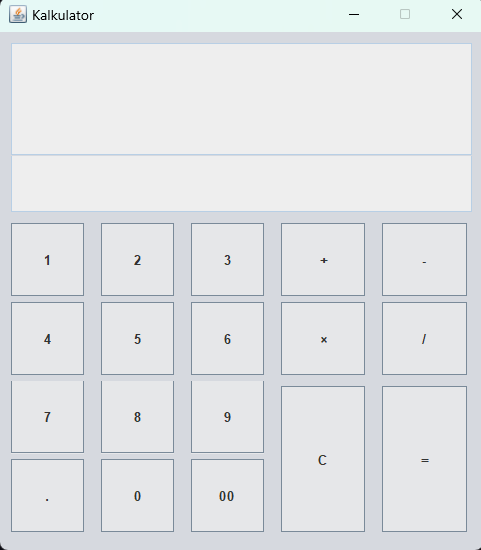

# Simple Calculator using Java Swing GUI

This is a simple calculator application built using Java Swing, 
a graphical user interface (GUI) library. It allows users to perform basic mathematical 
operations like addition, subtraction, multiplication, and division. The application provides a user-friendly interface for performing these calculations.

## Features
- Addition
- Subtraction
- Multiplication
- Division
- Clear button to reset the calculator
- User-friendly graphical interface

## Getting Started

### Prerequisites

- Java Development Kit (JDK): You need to have Java installed on your system to run this application.

### Preview


### Installation
Clone the repository to your local machine:

   ```bash
   git clone https://github.com/kevinjuliow/SimpleCalculator.git

